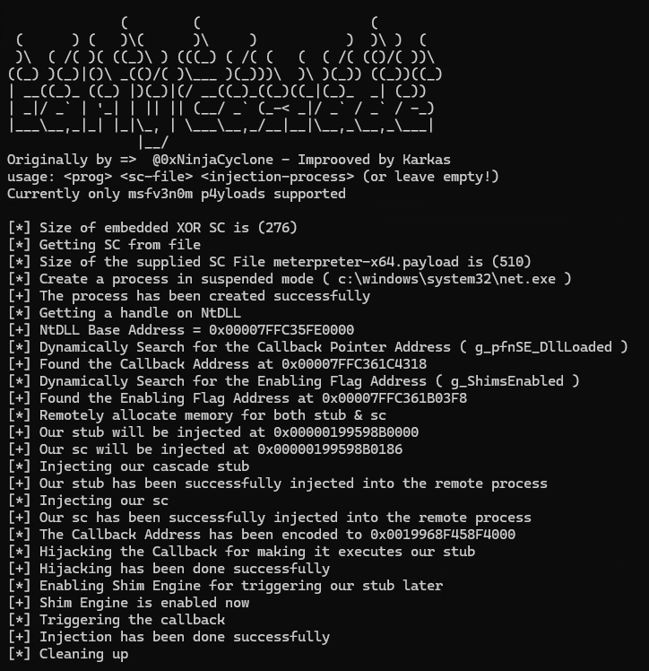

<h1 align="center">EarlyCascade Improved</h1>

  

> It's a modern and stealthy process injection technique was discovered by [Outflank](https://www.outflank.nl/) that involves injecting and executing code in the early stages of process creation before loading EDRs for their user mode detection measures. EarlyCascade technique forces enabling the Shim engine, allowing to hijack a Shim engine callback.

## Why "improved"
The original Code by [0xNinjaCyclone](https://github.com/0xNinjaCyclone/EarlyCascade) had hardcoded Injection Process Name and static plain Shellcode. I wanted to load dynamic Shellcode from files into a process of my choice. To get rid of plain msfvenom shellcode detections by several AVs I made a basic XOR Encryption of the embedded shellcode. I also made a Visual Studio 2022 Template, ready to compile and run.
Did not yet find the problem why not msfvenom shellcode crashes the hosting payload process. So just use msfvenom SC for now. I successfully tested it with meterpreter_reverse_tcp

(Original Readme from here)
## About the proof-of-concept 
1. Creating a process in suspended mode.
2. Dynamically locating the addresses of enabling flag and callback.
3. Remotely allocating memory for our stub and shellcode.
4. Injecting the stub and shellcode into the target process.
5. Force the shim engine to be enabled.
6. Hijacking a shim engine callback.
7. Triggering the callback by resuming the process thread.

At this point, the stub gets executed, and does the following:
1. Disrupting the initialization of detection measures.
2. Disabling the Shim engine to avoid crash.
3. Queuing an Asynchronous Procedure Call (APC) that executes the shellcode later.

## References
- [Introducing Early Cascade Injection: From Windows Process Creation to Stealthy Injection](https://www.outflank.nl/blog/2024/10/15/introducing-early-cascade-injection-from-windows-process-creation-to-stealthy-injection/)
